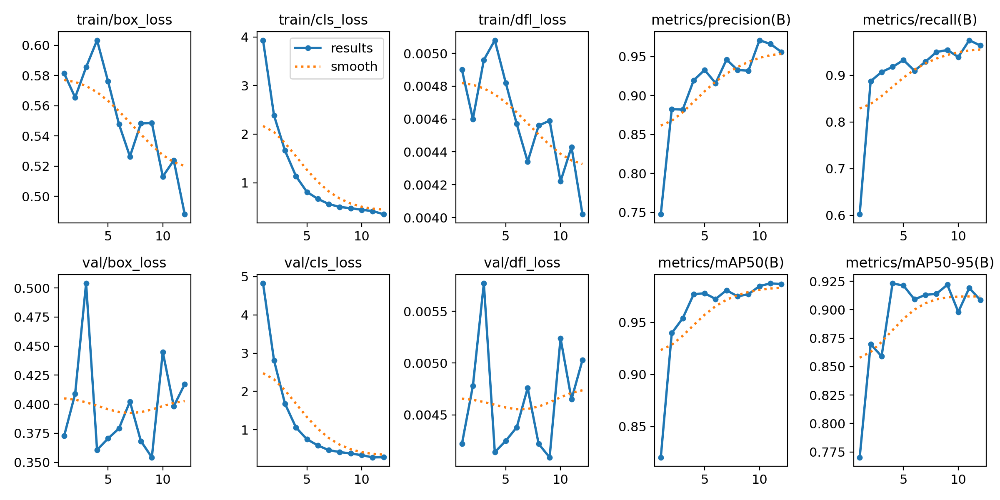
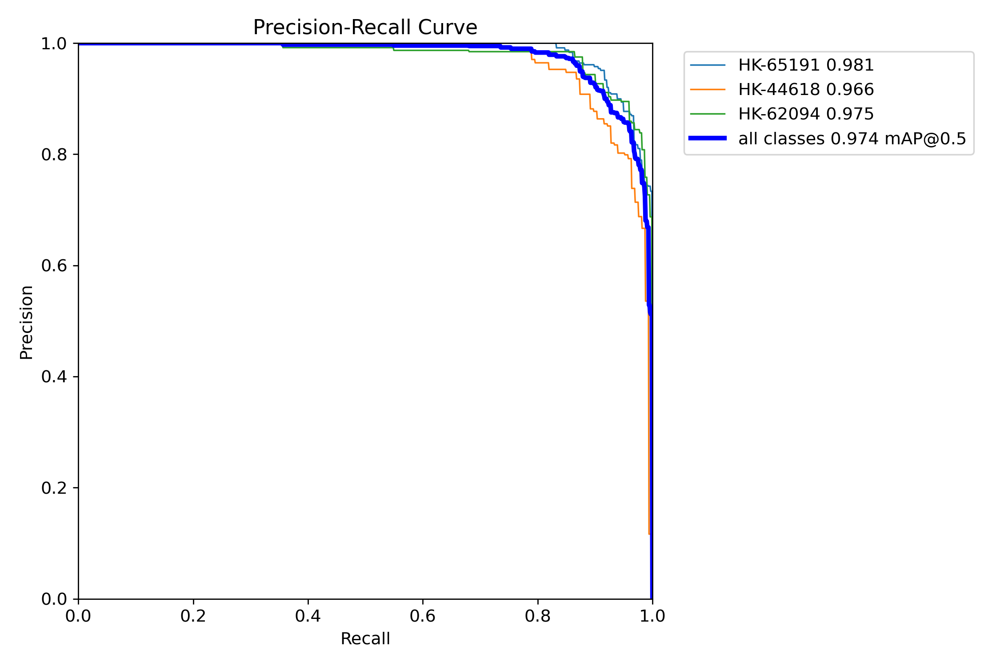
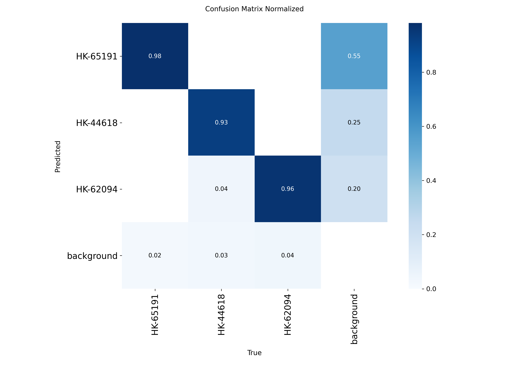
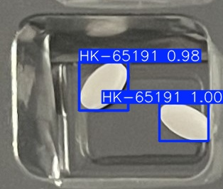
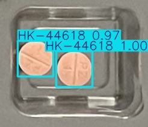
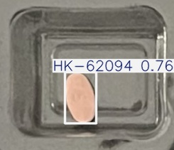

# Archived Results of the First Proof of Concept

This directory preserves the original exploratory YOLO26n baseline exactly as executed. A later confirmatory extension addressed its one-model, one-seed, and early-stopping limitations without replacing or rewriting the historical result. See [`confirmatory/`](confirmatory/README.md).

## Held-out test results

| Metric | Value |
|---|---:|
| Precision | 0.9288 |
| Recall | 0.8980 |
| mAP@0.50 | 0.9740 |
| mAP@0.50:0.95 | 0.9174 |

### Per-class mAP@0.50:0.95

| MEDISEG class | Value |
|---|---:|
| HK-65191 | 0.9075 |
| HK-44618 | 0.9172 |
| HK-62094 | 0.9275 |

Training was configured for a maximum of 40 epochs and stopped after epoch 12 through early stopping. The best validation mAP@0.50:0.95 occurred at epoch 4 (`0.9232`); the held-out test value was `0.9174`.

## Result figures

### Training and validation behavior

The curves summarize the optimization losses and validation metrics across the 12 completed epochs. Early stopping retained the checkpoint associated with the best validation performance rather than the final epoch.

### Precision-Recall performance

The three class-specific curves remain near the upper-right region. Their average corresponds to an overall test mAP@0.50 of `0.9740`.

### Normalized confusion matrix

The diagonal values show strong class-level agreement. Predictions assigned to background and missed detections remain important when selecting the operating confidence threshold.

### Representative test predictions

The following examples were selected deterministically from the held-out test partition using seed 42.

| HK-65191 | HK-44618 | HK-62094 |
|---|---|---|
|  |  |  |

These images demonstrate detections under the controlled visual conditions represented in MEDISEG. They are illustrative examples and are not a substitute for the complete quantitative evaluation.

## Artifact inventory

- `test_metrics.json`: final test metrics and per-class values.
- `dataset_summary.json`: dataset provenance, seed, class names, and split counts.
- `environment.json`: Python, PyTorch, Ultralytics, and GPU versions.
- `split_manifest.csv`: assignment of all 2,333 images.
- `data.yaml`: class mapping and YOLO partition configuration used in Colab.
- `training/args.yaml`: complete training configuration.
- `training/results.csv`: epoch-by-epoch training and validation history.
- `figures/`: training curves, precision-recall, F1-confidence, and confusion matrices.
- `predictions/`: representative detections on test images.
- `SHA256SUMS.txt`: integrity hashes for all archived result files.

## Audit notes

- The manifest contains 2,333 unique image IDs and filenames.
- The split contains 1,633 training, 350 validation, and 350 test images.
- A local content-hash audit found no exact duplicate images across the three partitions.
- The experiment represents one model family and one seed; it does not measure run-to-run variability.
- Acquisition-session identifiers were unavailable, so correlated or near-duplicate captures cannot be ruled out completely.
- The confidence curve reports an overall maximum F1 of approximately 0.91 near a confidence threshold of 0.51. Error counts depend on the chosen operating threshold.

## Correct interpretation

These results show that YOLO26n achieved high internal performance for detecting three pill classes in the MEDISEG test partition. They should be treated as a first technical proof of concept within the original AI-DOTS project, not as validation of swallowing, adherence, tuberculosis medication recognition, or clinical readiness.

## Subsequent confirmatory extension

After feedback on experimental stability, three detectors were screened for 40 complete epochs using validation only. YOLO26n was then evaluated with five predeclared seeds. The confirmatory held-out test mAP@0.50:0.95 was `0.9515 ± 0.0054` (mean ± SD). These newer results are additive; they do not invalidate or overwrite the exploratory baseline above.
