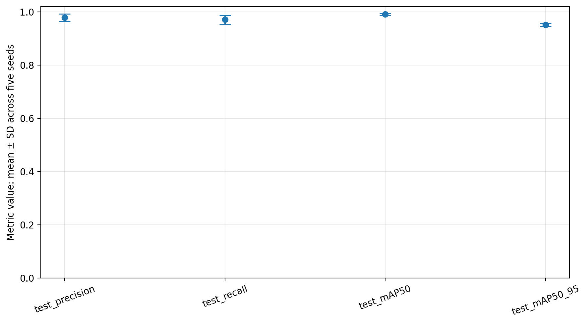

# Confirmatory Robustness Results

## Purpose

This folder archives the confirmatory extension completed after feedback on the first MEDISEG proof of concept. The original early-stopped, single-seed YOLO26n result remains preserved in the parent `results/` folder as a historical exploratory baseline.

The extension addresses three limitations of that baseline:

1. only one detector had been evaluated;
2. training used early stopping; and
3. run-to-run variability had not been measured.

It does not alter the AI-DOTS research question or protocol. It remains a controlled three-pill detection experiment and does not validate tuberculosis medication, swallowing, adherence, patients, or clinical deployment.

## Predeclared design

- Dataset: MEDISEG v2 `3pills`, DOI `10.25383/city.28574786.v2`
- Fixed image-level split: 1,633 train, 350 validation, 350 test
- Screening seed: 42
- Candidates: YOLO26n, YOLO11n, and RT-DETR-L
- Training budget: 40 complete epochs for every run
- Early stopping: effectively disabled with `patience=1000`
- Model-selection metric: validation mAP@0.50:0.95
- Tie rule: when models differ by less than 0.01 mAP, select the model with fewer parameters
- Final training seeds: 7, 21, 42, 84, and 123
- Test-set role: final evaluation only; not used for model selection

## Detector screening

| Model | Family | Parameters | Validation precision | Validation recall | Validation mAP@0.50 | Validation mAP@0.50:0.95 | Inference, ms/image |
|---|---|---:|---:|---:|---:|---:|---:|
| RT-DETR-L | RT-DETR | 32,970,476 | 0.9930 | 0.9939 | 0.9927 | 0.9579 | 15.44 |
| YOLO26n | YOLO | 2,572,280 | 0.9820 | 0.9713 | 0.9926 | 0.9541 | 2.08 |
| YOLO11n | YOLO | 2,624,080 | 0.9902 | 0.9932 | 0.9941 | 0.9530 | 1.32 |

RT-DETR-L obtained the highest validation mAP@0.50:0.95, but its advantage over YOLO26n was `0.0038`, within the predeclared `0.01` tie margin. The lower-parameter tie-breaker therefore selected YOLO26n. This is a course benchmark under one controlled protocol, not a universal ranking of the architectures.

## Five-seed held-out test results

| Seed | Precision | Recall | mAP@0.50 | mAP@0.50:0.95 |
|---:|---:|---:|---:|---:|
| 7 | 0.9856 | 0.9826 | 0.9940 | 0.9557 |
| 21 | 0.9817 | 0.9756 | 0.9935 | 0.9537 |
| 42 | 0.9745 | 0.9720 | 0.9907 | 0.9504 |
| 84 | 0.9566 | 0.9419 | 0.9841 | 0.9426 |
| 123 | 0.9934 | 0.9822 | 0.9940 | 0.9550 |

| Metric | Mean | Standard deviation | Minimum | Maximum | Descriptive 95% t interval |
|---|---:|---:|---:|---:|---:|
| Precision | 0.9784 | 0.0140 | 0.9566 | 0.9934 | 0.9610–0.9957 |
| Recall | 0.9709 | 0.0168 | 0.9419 | 0.9826 | 0.9500–0.9917 |
| mAP@0.50 | 0.9913 | 0.0043 | 0.9841 | 0.9940 | 0.9860–0.9965 |
| mAP@0.50:0.95 | 0.9515 | 0.0054 | 0.9426 | 0.9557 | 0.9448–0.9581 |



The seed-84 run was retained even though it produced the lowest values. Keeping all predeclared runs prevents selective reporting. The mAP@0.50:0.95 standard deviation was `0.0054`, approximately 0.56% of the mean.

## Reproducibility note

The seed-42 YOLO26n configuration was run once during screening and again during the multi-seed phase. The validation mAP@0.50:0.95 values were `0.9541` and `0.9524`, a relative difference of approximately 0.17%. The checkpoints were not byte-identical despite deterministic settings. The result is therefore stable at the metric level in the documented GPU environment, but it is not claimed to be byte-for-byte deterministic.

## Artifact inventory

- `model_screening_results.csv`: three-detector validation comparison
- `model_selection.json`: locked selection rule and selected detector
- `multiseed_test_results.csv`: one row for each final training seed
- `multiseed_summary.csv`: mean, standard deviation, range, and descriptive interval
- `multiseed_metrics_mean_sd.png`: summary figure
- `experiment_config.json`: predeclared experimental settings
- `environment.json`: Python, PyTorch, Ultralytics, CUDA, and GPU record
- `data.yaml`, `dataset_summary.json`, `split_manifest.csv`: dataset and immutable split documentation
- `run_metadata/`: `args.yaml` and epoch-level `results.csv` for all eight runs
- `SHA256SUMS.txt`: integrity hashes for the curated artifacts

The original 242 MB Colab archive and duplicate model checkpoints are intentionally not committed. A verified offline backup is retained by the researcher.

## Verification

From the repository root:

```bash
python 05_pipeline/src/verify_confirmatory_artifacts.py 05_pipeline/results/confirmatory
```

## Correct interpretation

The extension demonstrates stable internal performance for detecting three MEDISEG pill classes and documents sensitivity to model choice and training seed. It does not demonstrate ingestion verification, medication adherence, tuberculosis-pill recognition, external validity, or clinical readiness.
