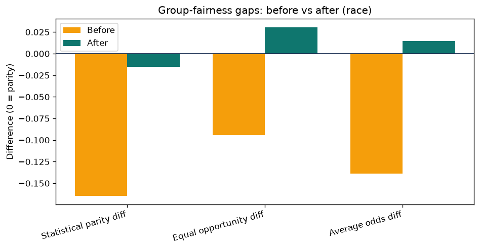

# Bias Audit Report: COMPAS Race Audit with AIF360

**Researcher:** Jean Pierre Tincopa Flores  
**Course:** Research Methods and Scientific Integrity in AI and Advanced Technologies, UNMSM  
**Audit date:** 1 August 2026  
**Verification status:** ANALYZED - executed successfully; findings are descriptive, not causal

## 1. Scope and relationship to AI-DOTS

This report is an independent course artifact demonstrating how to measure and mitigate group-level algorithmic bias. It audits the public COMPAS recidivism dataset and does **not** evaluate MEDISEG or establish demographic fairness properties for AI-DOTS.

MEDISEG contains pill images but no participant demographics or protected attributes. Applying race- or sex-based AIF360 metrics to MEDISEG would therefore be methodologically invalid. AI-DOTS can currently report technical performance by pill class and capture condition; demographic fairness requires an ethically approved dataset designed for that purpose.

COMPAS contains records about real people. Its use here creates no new participant data, but the analysis still requires careful interpretation, purpose limitation, and recognition that the affected people did not choose to become a standard machine-learning benchmark.

## 2. Dataset, groups, and favorable outcome

- **Dataset:** AIF360 `CompasDataset` derived from ProPublica's public two-year recidivism data
- **Rows after AIF360 processing:** 6,167
- **Features:** 401
- **Training/test split:** 4,316 / 1,851 (70% / 30%)
- **Split seed:** 42
- **Protected attribute:** race
- **Privileged group:** Caucasian
- **Unprivileged group:** African-American
- **Label:** `two_year_recid`
- **Favorable outcome:** `0 = not rearrested within two years`
- **Unfavorable outcome:** `1 = rearrested within two years`

The favorable direction is essential. Treating label 1 as favorable would preserve plausible-looking metric magnitudes while reversing their ethical interpretation.

The downloaded CSV contained 2,546,489 bytes and had SHA-256:

`C451DB85908B2F7FEF1D83203BEDF6B71ECDA0D5AF468D82AE62178F91D0CC7D`

## 3. Audit design

The baseline is a standardized logistic regression with `random_state=42` and `max_iter=1000`. The protected race attribute remains among the AIF360 features, so this audit does not claim "fairness through unawareness." Removing race alone would not remove correlated proxy information.

The selected mitigation is AIF360 **Reweighing**, a pre-processing method. Reweighing retains features and labels but assigns training weights to group-label combinations to reduce dependence between group membership and the favorable outcome. The mitigated model uses the same scaler, model family, hyperparameters, test set, and metrics as the baseline.

Reweighing was selected because it is deterministic and directly targets statistical parity/disparate impact. It does not guarantee calibration, equalized odds, individual fairness, or causal fairness.

## 4. Metrics and decision rules

| Metric | Interpretation | Parity reference |
|---|---|---:|
| Accuracy | Share of correct predictions | Higher is better, but does not measure fairness |
| Disparate impact (DI) | Favorable prediction rate for unprivileged group divided by privileged group | 1.0 |
| Statistical parity difference (SPD) | Favorable prediction rate for unprivileged minus privileged group | 0.0 |
| Equal opportunity difference (EOD) | True-positive-rate difference between groups | 0.0 |
| Average odds difference (AOD) | Average between-group difference in true- and false-positive rates | 0.0 |

The four-fifths threshold (`DI >= 0.8`) is used as a diagnostic rule of thumb in this course exercise. Passing it is not proof that a model is legally compliant, ethically acceptable, calibrated, or free of discriminatory harm.

## 5. Bias already present in the labels

Before any classifier was fitted, the training labels showed:

| Raw-data metric | Value |
|---|---:|
| Disparate impact | 0.850 |
| Statistical parity difference | -0.090 |
| Favorable base rate, African-American group | 0.510 |
| Favorable base rate, Caucasian group | 0.600 |

The favorable outcome is therefore less common in the unprivileged group in the processed historical data. This is an observed distributional difference, not evidence that race causally determines recidivism.

## 6. Before and after results

| Metric | Before | After Reweighing | Change |
|---|---:|---:|---:|
| Accuracy | 0.664 | 0.653 | -0.011 |
| Disparate impact | 0.773 | 0.975 | +0.202 |
| Statistical parity difference | -0.165 | -0.016 | +0.149 |
| Equal opportunity difference | -0.095 | +0.031 | +0.125 |
| Average odds difference | -0.139 | +0.015 | +0.154 |

The baseline failed the four-fifths rule (`DI=0.773`); the reweighted model passed it (`DI=0.975`). Statistical parity moved substantially closer to zero. Accuracy decreased by 0.011, or 1.1 percentage points.

The result is not a uniform improvement across every definition of fairness. EOD crossed zero from -0.095 to +0.031, and AOD crossed from -0.139 to +0.015. Reweighing therefore slightly overcorrected these two difference metrics, changing which group received the relative advantage. The after-values are closer to zero in magnitude, but the sign change must not be hidden.

## 7. Resampling uncertainty

The complete pipeline was repeated across ten seeded train/test splits.

| Metric | Before mean | Before SD | After mean | After SD | Mean change |
|---|---:|---:|---:|---:|---:|
| Accuracy | 0.671 | 0.013 | 0.665 | 0.012 | -0.006 |
| Disparate impact | 0.775 | 0.032 | 1.000 | 0.063 | +0.225 |
| Statistical parity difference | -0.161 | 0.027 | -0.001 | 0.039 | +0.159 |
| Equal opportunity difference | -0.091 | 0.029 | +0.053 | 0.030 | +0.144 |
| Average odds difference | -0.140 | 0.024 | +0.021 | 0.036 | +0.162 |

Under the notebook's descriptive heuristic, the DI and EOD changes were large relative to the after-split SD, whereas the mean accuracy change (-0.006) was smaller than its variability and was labeled not distinguishable from noise. This is a stability check, not a formal hypothesis test or confidence interval. Ten splits do not establish population-level statistical significance.

The positive mean EOD and AOD after mitigation reinforce the single-split warning: Reweighing systematically moved these metrics past zero in this configuration. Optimizing statistical parity redistributed, rather than eliminated, all forms of error.

## 8. Independent metric cross-check

Fairlearn was used to cross-check the demographic-parity result. Because Fairlearn treats label 1 as selected, the COMPAS favorable label first had to be recoded from 0 to 1.

| Check | Result |
|---|---:|
| AIF360 after DI | 0.975 |
| AIF360 after SPD | -0.016 |
| Fairlearn naive ratio using original labels | 0.960 (wrong outcome direction) |
| Fairlearn corrected demographic-parity ratio | 0.975 |
| Fairlearn corrected demographic-parity difference magnitude | 0.016 |
| Accuracy, African-American group | 0.651 |
| Accuracy, Caucasian group | 0.656 |

The corrected Fairlearn ratio matches AIF360. The naive calculation demonstrates why favorable-outcome encoding must be declared and tested rather than assumed.

## 9. Ethical trade-off

Reweighing improved the selected statistical-parity objective at a small average accuracy cost. That trade-off is not morally neutral. In the COMPAS context, false-positive and false-negative errors affect liberty and public-safety decisions differently, and parity of favorable selection rates does not resolve unequal error rates or calibration.

The audit therefore supports only this narrow conclusion: under the specified data processing, model, split, and threshold, Reweighing moved group selection-rate metrics closer to parity. It does not show that COMPAS became fair, unbiased, suitable for deployment, or causally valid.

## 10. Statistical fallacy scan

Coverage: **11/11 checks completed**.

| Fallacy | Assessment |
|---|---|
| 1. Simpson's paradox | No reversal was demonstrated for the audited race groups, but intersectional race-by-sex patterns were not tested; cannot be excluded. |
| 2. Ecological fallacy | Group-level metrics are not used to infer that any individual prediction is fair or unfair. |
| 3. Berkson's paradox | CAUTION: the dataset represents people selected into a criminal-justice process; results cannot generalize to the wider population. |
| 4. Collider bias | No causal adjustment set was claimed. Potential selection/collider structure in justice-system variables was not identified by this predictive audit. |
| 5. Base-rate neglect | Addressed by reporting favorable base rates of 0.510 and 0.600 and by interpreting fairness metrics together. |
| 6. Regression to the mean | Not a pre/post study of participants selected for extreme scores; not applicable to the mitigation comparison. |
| 7. Survivorship bias | No longitudinal completion analysis was performed. AIF360 removed five missing-data rows; broader source/filter selection remains a limitation. |
| 8. Look-elsewhere effect | Metrics and one mitigation were specified by the workshop before results were interpreted; no significance mining was performed. |
| 9. Garden of forking paths | CAUTION: the audit was not preregistered and examined one classifier and threshold. Ten split seeds provide limited robustness, not full multiverse analysis. |
| 10. Correlation is not causation | No claim is made that race causes recidivism or that Reweighing causally resolves social inequity. |
| 11. Reverse causality | No directional causal relation between protected group and outcome is inferred. |

## 11. Limitations

- COMPAS is a historical criminal-justice dataset with contested labels, selection processes, and social meaning.
- Only race was audited; sex and intersectional race-by-sex groups were not analyzed.
- Only logistic regression, one default decision threshold, and one mitigation were compared.
- The audit emphasizes group metrics and does not evaluate individual fairness.
- Calibration, predictive-value parity, subgroup FPR/FNR tables, threshold curves, and distribution shift were not fully audited.
- The ten-split analysis reports descriptive mean/SD rather than paired confidence intervals or preregistered inference.
- The four-fifths rule is a screening heuristic, not an all-purpose fairness or legal standard.
- Reweighing can redistribute error and produced sign reversals in EOD and AOD.
- Results do not transfer to MEDISEG, tuberculosis treatment, pill ingestion, or AI-DOTS clinical use.

## 12. Recommendation

Do not deploy a model on the strength of these results. A subsequent audit should pre-specify the decision context and harm priority; report group and intersectional FPR, FNR, PPV, calibration, and uncertainty; compare multiple mitigations and thresholds on untouched validation data; assess label validity and dataset selection; and establish human oversight and a contestability process.

For AI-DOTS, demographic fairness assessment must wait for an ethically approved, purpose-built human dataset with justified attributes and adequate subgroup sample sizes. Until then, report only technical robustness by pill class and capture condition.

## 13. Reproducibility

The executed notebook is `bias_audit_lab.ipynb`. It records the dataset direction, split, seed, preprocessing, baseline, mitigation, before/after metrics, ten-split uncertainty analysis, Fairlearn cross-check, environment versions, and plot.

Environment:

- AIF360 0.6.1
- Fairlearn 0.14.0
- pandas 2.3.3
- scikit-learn 1.9.0
- Python 3.11.15

## 14. References

1. Angwin, J., Larson, J., Mattu, S., & Kirchner, L. (2016). *Machine Bias*. ProPublica. https://www.propublica.org/article/machine-bias-risk-assessments-in-criminal-sentencing
2. ProPublica. *COMPAS Analysis repository*. https://github.com/propublica/compas-analysis
3. Bellamy, R. K. E., et al. (2019). AI Fairness 360: An extensible toolkit for detecting and mitigating algorithmic bias. *IBM Journal of Research and Development*, 63(4/5). https://doi.org/10.1147/JRD.2019.2942287
4. IBM. *AI Fairness 360 documentation*. https://aif360.readthedocs.io/en/stable/
5. Fairlearn contributors. *Fairlearn documentation*. https://fairlearn.org/
6. Chouldechova, A. (2017). Fair prediction with disparate impact: A study of bias in recidivism prediction instruments. *Big Data*, 5(2), 153-163. https://doi.org/10.1089/big.2016.0047
7. Kleinberg, J., Mullainathan, S., & Raghavan, M. (2017). Inherent trade-offs in the fair determination of risk scores. *Proceedings of ITCS 2017*. https://doi.org/10.4230/LIPIcs.ITCS.2017.43

